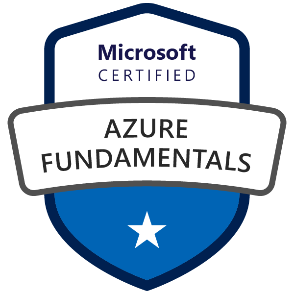
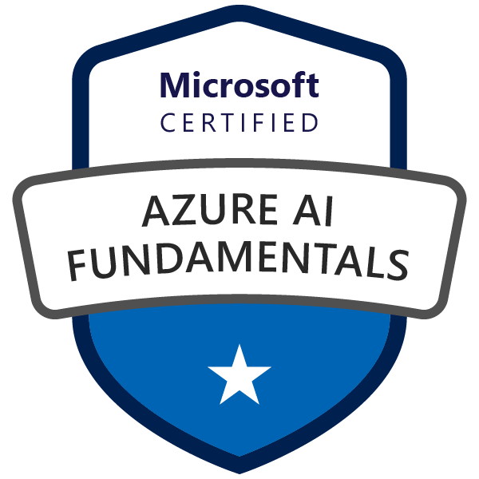
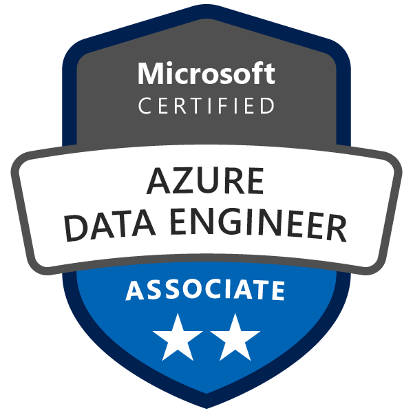
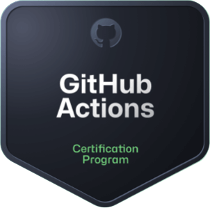

<h1 align="center"><b>Hi there, I'm Lorens </b></h1>

  <em>Software Engineer building scalable data solutions and cloud infrastructure</em>

## 💡 About Me

In my latest years, I've learned that while I truly enjoy diving into technical challenges, **code is a means to an end**; the real goal is developing things that people will actually use and deliver tangible value.

I build well-architected systems and automate processes wherever possible. I try to stay ahead by constantly challenging myself to learn new patterns and be more comprehensive in my solutions.

**Teaching and learning** are at the core of my approach. I believe in sharing knowledge.

My expertise primarily lies in **backend development, data engineering, and DevOps**. Although I'm flexible enough to contribute in other areas.

I believe now more than ever that **having a strong foundation of knowledge and working towards solid architecture and design principles is essential** to getting the most out of AI tools.

## 🚀 Main Tech Stack

  
  
  

## 🛠️ Frameworks & Libraries

  
  
  
  
  
  
  
  

> [!NOTE]
> These are my favorite used frameworks/libraries although it doesn't include all I know nor the usual standard library of every language. Take it as a reference.

## 🛡️ Certifications

### Microsoft Azure

  
  
  
  
  
  

### Databricks

  
  
  

### GitHub

  
  

>
> Verify my credentials on linkedin

## 📚 Interested in learning

  
  
  
  

  <i>Let's build something!</i>

  

